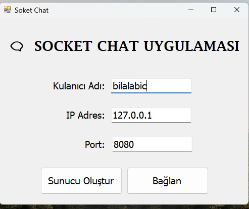
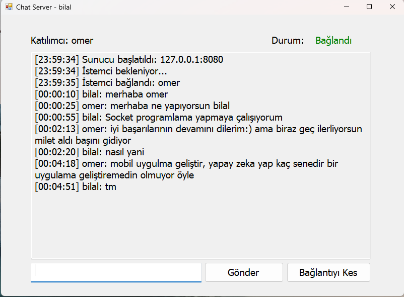
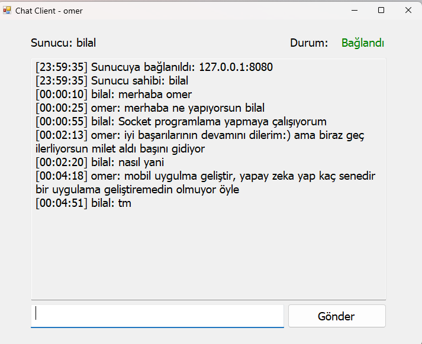

# 💬 Socket Chat

**Socket chat**, TCP Socket protokolüyle iki kullanıcının gerçek zamanlı mesajlaşmasını sağlayan bir **Windows Forms uygulamasıdır**.


---

## 📋 İçindekiler
- [✨ Özellikler](#-özellikler)
- [📸 Ekran Görüntüleri](#-ekran-görüntüleri)
- [🔧 Gereksinimler](#-gereksinimler)
- [📥 Kurulum](#-kurulum)
- [🚀 Kullanım](#-kullanım)
- [🛠️ Teknik Detaylar](#-teknik-detaylar)
- [📁 Proje Yapısı](#-proje-yapısı)
- [🧪 Test Senaryoları](#-test-senaryoları)
- [🤝 Katkıda Bulunma](#-katkıda-bulunma)
- [🐛 Bilinen Sorunlar](#-bilinen-sorunlar)
- [📚 Öğrenme Kaynakları](#-öğrenme-kaynakları)
- [📄 Lisans](#-lisans)
- [📧 İletişim](#-iletişim)
- [📝 Sürüm Geçmişi](#-sürüm-geçmişi)
- [⚠️ Önemli Notlar](#-önemli-notlar)

---

## ✨ Özellikler
- **TCP Socket iletişimi:** Güvenilir ve hızlı bağlantı  
- **Peer-to-Peer mesajlaşma:** Doğrudan iki kullanıcı arasında iletişim  
- **Async/Await yapısı:** Asenkron mesaj gönderme ve alma  
- **Kullanıcı adı tanıma:** Otomatik username alışverişi  
- **Gerçek zamanlı bağlantı durumu**  
- **Zaman damgalı mesajlar**  
- **Enter tuşu desteği**  
- **Thread-safe UI güncellemeleri**  
- **Kolay bağlantı yönetimi**

---

## 📸 Ekran Görüntüleri
| Görsel | Açıklama |
|:--|:--|
|  | Kullanıcı adı, IP ve port bilgilerinin girildiği ana ekran. Sunucu oluşturma ve Sunucuya bağlanma ekranı |
|  |  Mesajlaşma ekranı ve Bağlantı sonlandırma |
|  |  Mesajlaşma ekranı |

---

## 🔧 Gereksinimler
- **İşletim Sistemi:** Windows 7 veya üzeri  
- **.NET Framework:** 4.8  
- **Geliştirme Ortamı:** Visual Studio 2019 veya üzeri  
- **C# Sürümü:** 7.3

---

## 📥 Kurulum
```bash
# 1. Projeyi klonlayın
git clone https://github.com/BilalAbic/DemoChatSocketApp.git
cd DemoChatSocketApp
```

2. `DemoChatSocketApp.sln` dosyasını Visual Studio’da açın  
3. **Build > Build Solution** veya `Ctrl+Shift+B` ile derleyin  
4. **F5** (Debug) veya **Ctrl+F5** (Release) ile çalıştırın

---

## 🚀 Kullanım

### 🔹 Adım 1: Ana Ekran
- **Kullanıcı Adı:** Görünecek isminiz  
- **IP:** `127.0.0.1` (lokal test için)  
- **Port:** Önerilen `8080`

### 🔹 Adım 2: Sunucu Oluşturma
1. “Sunucu Oluştur” butonuna tıklayın  
2. Sunucu `TcpListener` ile başlar ve istemci bekler  
3. İstemci bağlandığında durum **“Bağlandı”** olur  
4. Artık mesajlaşabilirsiniz

### 🔹 Adım 3: İstemci Bağlantısı
1. Yeni bir uygulama örneği açın  
2. Aynı IP ve Port’u girin  
3. “İstemciye Bağlan” tıklayın  
4. Bağlantı kurulduğunda sunucu kullanıcı adı görüntülenir  

### 💬 Mesajlaşma İpuçları
- **Enter** tuşu ile hızlı mesaj gönderin  
- **Sunucu tarafı** “Bağlantıyı Kes” butonunu kullanabilir  
- Mesajlar `[HH:mm:ss] Kullanıcı: Mesaj` formatındadır  

---

## 🛠️ Teknik Detaylar

### ⚙️ Kullanılan Teknolojiler
| Katman | Teknoloji |
|:--|:--|
| Dil | C# 7.3 |
| Framework | .NET Framework 4.8 |
| UI | Windows Forms |
| İletişim | System.Net.Sockets (TCP) |
| Asenkron İşlem | Async/Await, NetworkStream |

### 🔁 Bağlantı Akışı
```
Main -> Server: Sunucu oluştur
Server -> TcpListener: İstemci bekle
Client -> Server: Bağlantı isteği
Server <-> Client: USERNAME alışverişi
Server <-> Client: Mesaj gönder/al
```

### 📡 İletişim Protokolü
**Username alışverişi:**
```
Server → Client: USERNAME:ServerUsername
Client → Server: USERNAME:ClientUsername
```

**Mesaj formatı:**
- UTF-8 byte array  
- Maksimum 1024 byte  
- Görünüm: `[HH:mm:ss] Kullanıcı: Mesaj`

---

### 🧩 Önemli Sınıflar

#### `Main.cs`
| Metod | Açıklama |
|:--|:--|
| `btnServerCreate_Click()` | Sunucu formunu açar |
| `btnClientCon_Click()` | İstemci formunu açar |
| `ValidateInputs()` | Kullanıcı giriş doğrulaması |

#### `ChatServer.cs`
- `StartServer()`, `ReceiveMessages()`, `SendMessage()`, `Disconnect()`, `AddMessage()`

**Alanlar:**  
`_username`, `_clientUsername`, `_server`, `_client`, `_stream`, `_isRunning`

#### `ChatClient.cs`
- `ConnectToServer()`, `ReceiveMessages()`, `SendMessage()`, `Disconnect()`, `AddMessage()`

**Alanlar:**  
`_username`, `_serverUsername`, `_client`, `_stream`, `_isConnected`

---

### 🔒 Thread-Safe UI
```csharp
if (control.InvokeRequired)
{
    control.Invoke(new Action(() => { /* UI güncelleme */ }));
}
else
{
    // UI güncelleme
}
```

### ⚠️ Hata Yönetimi
- `try-catch` blokları ile yakalanır  
- Kullanıcıya anlamlı hata mesajı verilir  
- Form kapatıldığında otomatik `Disconnect()` çağrılır  

---

## 📁 Proje Yapısı
```
DemoChatSocketApp/
│
├── DemoChatSocketApp/
│   ├── Main.cs / .Designer.cs / .resx
│   ├── ChatServer.cs / .Designer.cs / .resx
│   ├── ChatClient.cs / .Designer.cs / .resx
│   ├── Program.cs
│   └── Properties/
│       ├── AssemblyInfo.cs
│       ├── Resources.resx
│       ├── Settings.settings
│       └── licenses.licx
│
├── screenshots/
│   ├── main-screen.png
│   ├── server-screen.png
│   └── client-screen.png
│
├── .gitignore
├── README.md
└── DemoChatSocketApp.sln
```

---

## 🧪 Test Senaryoları

### Lokal Test
1. Uygulamayı çalıştır  
2. IP: `127.0.0.1`, Port: `8080`  
3. Sunucu oluştur, ikinci instance ile bağlan  
4. Mesajlaşmayı test et  

### Ağ Üzerinden Test
- **Sunucu:** IP öğren (`ipconfig`), 8080 portunu aç  
- **İstemci:** Aynı IP ve port ile bağlan  

### Hata Durumları
| Durum | Mesaj |
|:--|:--|
| Sunucu yok | “Sunucuya bağlanılamadı” |
| Port dolu | “Address already in use” |
| Bağlantı kesildi | Otomatik disconnect |
| Geçersiz IP | Bağlantı hatası |

---

## 🤝 Katkıda Bulunma
1. Repo’yu fork edin  
2. Yeni branch açın: `feature/YeniOzellik`  
3. Commit → Push → Pull Request  

### Kod Standartları
- C# naming conventions  
- Async/await yapısı  
- Exception handling  
- XML doc comments  
- Thread-safe yapı

### Gelecek Özellikler
- [ ] Grup sohbeti  
- [ ] Dosya gönderme  
- [ ] Emoji ve tema desteği  
- [ ] Mesaj geçmişi (SQLite)  
- [ ] Şifreleme (AES)  
- [ ] Ses bildirimi  
- [ ] Kullanıcı listesi  
- [ ] Otomatik yeniden bağlanma  

---

## 🐛 Bilinen Sorunlar
- Firewall bağlantıyı engelleyebilir  
- Çok hızlı mesaj gönderiminde buffer taşabilir  
- Form kapatılırken bazen thread hatası oluşabilir  

---

## 📚 Öğrenme Kaynakları
- [Microsoft Docs - Socket Programming](https://docs.microsoft.com/en-us/dotnet/api/system.net.sockets)  
- [Async/Await Best Practices](https://docs.microsoft.com/en-us/archive/msdn-magazine/2013/march/async-await-best-practices-in-asynchronous-programming)  
- [TCP/IP Protocol (Wikipedia)](https://en.wikipedia.org/wiki/Transmission_Control_Protocol)
- [ChatGPT](https://chatgpt.com/)
- [Claude Code](https://claude.ai/)

---

## 📄 Lisans
Bu proje **MIT Lisansı** altında lisanslanmıştır.

---

## 📧 İletişim
- **E-posta:** bilalabic78@gmail.com
- **GitHub:** [@kullaniciadi](https://github.com/BilalAbic)  
- **LinkedIn:** [Profil Linki](https://linkedin.com/in/BilalAbic)

---

## 📝 Sürüm Geçmişi
### v1.0.0 (Ekim 2025)
- İlk sürüm yayınlandı  
- TCP Socket iletişimi  
- Async/Await yapısı  
- Username alışverişi  
- Thread-safe UI

---

## ⚠️ Önemli Notlar
1. Windows Firewall erişimine izin verin  
2. Bilgisayarların aynı ağda olduğundan emin olun  
3. Port çakışmalarına dikkat edin  
4. İnternet bağlantısı için port forwarding gerekebilir  
5. Hassas verilerde şifreleme önerilir  

---

**Geliştirici:** Bilal Abiç
**Son Güncelleme:** Ekim 2025  
**Versiyon:** 1.0.0  
**Framework:** .NET Framework 4.8  
**Dil:** C# 7.3  

---

<div align="center">

**Made with ❤️ using C# and .NET Framework**  
[⬆ Başa Dön](#-demochatsocketapp)

</div>
